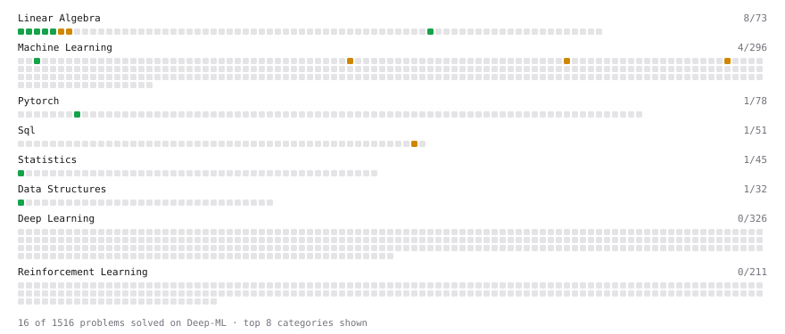

# Deep-ML

My machine learning practice from [Deep-ML](https://www.deep-ml.com). Every solution here was written by hand.

**6** solved · 6 problems · 0 labs · 0 math

[**Browse the interactive portfolio**](https://RohitShee.github.io/deep-ml/) to replay this filling in over time.

## Problems

| | Difficulty | Solved | |
| --- | --- | --- | --- |
| [Build an MLP with nn.Sequential](https://www.deep-ml.com/problems/887) | easy | 2026-09-15 | [solution](problems/0887-build-an-mlp-with-nn-sequential) |
| [Matrix-Vector Dot Product](https://www.deep-ml.com/problems/1) | easy | 2026-09-23 | [solution](problems/0001-matrix-vector-dot-product) |
| [Min-Max Scaling of Feature Values](https://www.deep-ml.com/problems/112) | easy | 2026-06-20 | [solution](problems/0112-min-max-scaling-of-feature-values) |
| [Transpose of a Matrix](https://www.deep-ml.com/problems/2) | easy | 2026-09-30 | [solution](problems/0002-transpose-of-a-matrix) |
| [Find the Best Gini-Based Split for a Binary Decision Tree](https://www.deep-ml.com/problems/138) | medium | 2026-09-24 | [solution](problems/0138-find-the-best-gini-based-split-for-a-binary-decision-tree) |
| [Numerical Gradient Checking](https://www.deep-ml.com/problems/313) | medium | 2026-09-16 | [solution](problems/0313-numerical-gradient-checking) |

---

_This file is regenerated by Deep-ML on every push._
